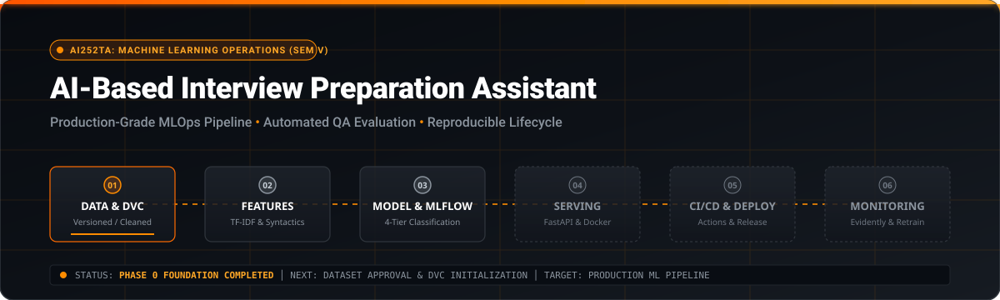
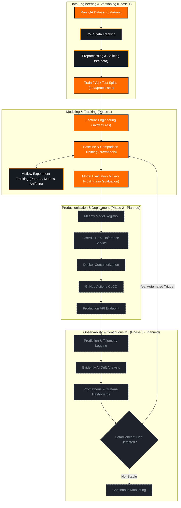

<div align="center">



# AI-Based Interview Preparation Assistant
### Production-Grade MLOps Pipeline & Continuous Delivery Platform

<p align="center">
  <strong>Data</strong> ➔ 
  <strong>Version</strong> ➔ 
  <strong>EDA</strong> ➔ 
  <strong>Features</strong> ➔ 
  <strong>Train</strong> ➔ 
  <strong>Track</strong> ➔ 
  <strong>Register</strong> ➔ 
  <strong>Serve</strong> ➔ 
  <strong>Monitor</strong> ➔ 
  <strong>Retrain</strong>
</p>

<!-- Technology Badges -->
[](https://www.python.org/)
[](https://dvc.org/)
[](https://mlflow.org/)
[](https://scikit-learn.org/)
[-1A1A1A?style=for-the-badge&logo=fastapi&logoColor=FF8C00)](https://fastapi.tiangolo.com/)
[-1A1A1A?style=for-the-badge&logo=docker&logoColor=FF8C00)](https://www.docker.com/)
[-1A1A1A?style=for-the-badge&logo=github-actions&logoColor=FF8C00)](https://github.com/features/actions)
[-1A1A1A?style=for-the-badge&logo=datadog&logoColor=FF8C00)](https://www.evidentlyai.com/)

<!-- Project & Academic Badges -->
[](https://github.com/Tejzraj/MLOps)
[](https://github.com/Tejzraj/MLOps)
[-FFA726?style=flat-square)](docs/PROJECT_STATUS.md)
[](LICENSE)
[](https://sdgs.un.org/goals/goal4)
[](https://sdgs.un.org/goals/goal8)

</div>

---

## Executive Summary

The **AI-Based Interview Preparation Assistant** is an end-to-end Machine Learning Operations (MLOps) platform designed to evaluate and coach candidates on technical and behavioral interview responses. The system analyzes interview question-answer pairs, assesses answer depth and correctness, and classifies response quality into a 4-tier standardized grading rubric to provide actionable, automated feedback.

Engineered for academic course **AI252TA (Machine Learning Operations - Semester V)**, this repository implements industry-standard MLOps practices: **versioned data pipelines with DVC**, **reproducible experiment tracking with MLflow**, **automated quality validation**, **containerized inference serving**, and **drift-triggered continuous retraining**.

> [!NOTE]
> **Foundation Status:** This project is at **Phase 0 (Foundation)**. No model weights, production deployments, or fabricated benchmark results are claimed. All milestones follow a structured, phased academic implementation plan.

---

## Real-Time Milestone Dashboard

```text
========================================================================================
                                 PROJECT PROGRESSION
========================================================================================
Phase 0: Foundation & Environment    [████████████████████] 100% (Completed)
Phase 1: Development & Reproduce     [░░░░░░░░░░░░░░░░░░░░]   0% (In Preparation)
Phase 2: Serving & CI/CD Pipeline    [░░░░░░░░░░░░░░░░░░░░]   0% (Planned)
Phase 3: Observability & Governance  [░░░░░░░░░░░░░░░░░░░░]   0% (Planned)
========================================================================================
CURRENT ACTIVE PHASE : PHASE 1 — DATASET SPECIFICATION & ACADEMIC DEFENSE
NEXT MILESTONE       : FACULTY APPROVAL & DVC DATASET INGESTION
========================================================================================
```

---

## Phase 1 Lifecycle & Dataset Execution Status

```text
Phase 1 Execution Flow:
Dataset Specification ──► Dataset Acquisition ──► EDA ──► Feature Engineering ──► Baseline Model ──► MLflow Tracking
    [IN PROGRESS]             [NOT STARTED]     [NOT STARTED]    [NOT STARTED]        [NOT STARTED]       [NOT STARTED]
```

| Lifecycle Component | Status | Artifact / Documentation Reference |
| :--- | :---: | :--- |
| **Dataset Specification** | `[~] IN PROGRESS` | [`docs/dataset/DATASET_SPECIFICATION.md`](docs/dataset/DATASET_SPECIFICATION.md) |
| **Labeling Guidelines & Rubric** | `[~] IN PROGRESS` | [`docs/dataset/LABELING_GUIDELINES.md`](docs/dataset/LABELING_GUIDELINES.md) |
| **Data Collection Protocol** | `[~] IN PROGRESS` | [`docs/dataset/DATA_COLLECTION.md`](docs/dataset/DATA_COLLECTION.md) |
| **Faculty Approval Dossier** | `[ ] PENDING REVIEW` | [`docs/dataset/DATASET_APPROVAL.md`](docs/dataset/DATASET_APPROVAL.md) |
| **Dataset Acquisition & DVC Tracking** | `[ ] NOT STARTED` | Planned under `data/raw/` tracked via DVC |
| **Exploratory Data Analysis (EDA)** | `[ ] NOT STARTED` | [`notebooks/01_data_exploration.ipynb`](notebooks/01_data_exploration.ipynb) |
| **Feature Engineering Pipeline** | `[ ] NOT STARTED` | [`notebooks/03_feature_engineering.ipynb`](notebooks/03_feature_engineering.ipynb), `src/features/` |
| **Baseline Model Training** | `[ ] NOT STARTED` | [`notebooks/04_baseline_models.ipynb`](notebooks/04_baseline_models.ipynb), `src/models/` |
| **MLflow Experiment Tracking** | `[ ] NOT STARTED` | Local & remote tracking configured in `mlruns/` |

---

## Machine Learning Problem Formulation

```
┌─────────────────────────────────┐       ┌─────────────────────────────────┐
│       Interview Question        │   +   │        Candidate Answer         │
└────────────────┬────────────────┘       └────────────────┬────────────────┘
                 │                                         │
                 └────────────────────┬────────────────────┘
                                      │
                                      ▼
                      ┌───────────────────────────────┐
                      │    ML Feature Extraction      │
                      │  (TF-IDF / Linguistic / Embed) │
                      └───────────────┬───────────────┘
                                      │
                                      ▼
                      ┌───────────────────────────────┐
                      │ Answer Quality Classification │
                      └───────────────┬───────────────┘
                                      │
        ┌──────────────┬──────────────┴──────────────┬──────────────┐
        ▼              ▼                             ▼              ▼
     Class 0        Class 1                       Class 2        Class 3
    [ Poor ]  [ Needs Improvement ]              [ Good ]     [ Excellent ]
```

### Problem Definition
- **Input:** Multi-turn technical or behavioral interview prompt (`interview_question`) and raw candidate textual response (`candidate_answer`).
- **Target Output:** 4-class ordinal quality classification score (`quality_label` $\in \{0, 1, 2, 3\}$).
- **Evaluation Criteria:**
  - **Class 0 (Poor):** Irrelevant, incoherent, factually erroneous, or fewer than 5 tokens.
  - **Class 1 (Needs Improvement):** Superficial answer missing critical concepts or terminology.
  - **Class 2 (Good):** Factually accurate, technically sound, and clearly articulated.
  - **Class 3 (Excellent):** Comprehensive explanation including trade-offs, architecture patterns, and edge cases.

---

## End-to-End MLOps Architecture



---

## Technology Stack

| Domain | Tool / Technology | Status | Role in Pipeline |
| :--- | :--- | :---: | :--- |
| **Language** | **Python 3.10+** |  | Core runtime environment across entire pipeline |
| **Data Ops** | **Pandas, NumPy** |  | Numerical transformations, dataframes, and sanitization |
| **Data Versioning** | **DVC (Data Version Control)** |  | Git-independent dataset versioning and pipeline orchestration |
| **Machine Learning** | **Scikit-learn** |  | Baseline classifiers, TF-IDF vectorization, evaluation metrics |
| **Prototyping** | **Jupyter Lab / Notebooks** |  | Exploratory data analysis, error inspection, visualization |
| **Experimentation** | **MLflow** |  | Experiment tracking, hyperparameter logging, model registry |
| **Testing** | **PyTest & Coverage** |  | Unit, integration, and model invariance testing |
| **Serving API** | **FastAPI & Uvicorn** |  | High-performance REST service for real-time inference |
| **Containerization** | **Docker** |  | Multi-stage, reproducible microservice container builds |
| **CI/CD** | **GitHub Actions** |  | Automated linting, test execution, container push |
| **Observability** | **Evidently AI** |  | Text drift detection, data quality, and model degradation |
| **Metrics & UI** | **Prometheus & Grafana** |  | System metric scraping and real-time operations dashboard |

---

## Detailed Multi-Phase Roadmap

### Legend
- `[x]` Completed
- `[~]` In Progress
- `[ ]` Not Started / Planned

```
Phase 0 ───► Phase 1 ───► Phase 2 ───► Phase 3 ───► Phase 4 ───► Phase 5
Foundation   Dev & Repro  Production   Observability Continuous ML Governance
 [100%]         [0%]         [0%]         [0%]         [0%]         [0%]
```

<details open>
<summary><strong>Phase 0 — Project Foundation & Architecture (COMPLETED)</strong></summary>

- [x] Repository initialized with clean remote tracking on `main`
- [x] Full MLOps directory hierarchy initialized (`src/`, `data/`, `notebooks/`, `docs/`, `tests/`)
- [x] Central parameter management configured (`params.yaml`, `configs/config.yaml`)
- [x] Dependency management configured (`requirements.txt`, `requirements-dev.txt`, `pyproject.toml`)
- [x] DVC pipeline blueprint initialized (`dvc.yaml`)
- [x] Developer automation scripts added (`Makefile`)
- [x] Project governance and licensing created (`LICENSE`, `CONTRIBUTING.md`, `CODE_OF_CONDUCT.md`, `CHANGELOG.md`)
- [x] Custom SVG asset and architecture documentation authored
</details>

<details open>
<summary><strong>Phase 1 — Development & Reproducibility (CURRENT FOCUS)</strong></summary>

- [x] Dataset specification, 19-field schema, and multi-dimensional rubric authored
- [x] Faculty review dossier prepared (`docs/dataset/DATASET_APPROVAL.md`)
- [ ] Faculty committee review and formal approval (Pending)
- [x] DVC initialized with pipeline blueprint (`dvc.yaml`)
- [ ] Question-bank acquisition & candidate response collection/creation
- [ ] Human / rubric-based annotation and team dual-audit validation
- [ ] DVC raw dataset versioning (`data/raw/interview_data.parquet.dvc`)
- [ ] Data quality checks and schema verification implemented
- [ ] Exploratory Data Analysis completed (`notebooks/01_data_exploration.ipynb`)
- [ ] Data preprocessing and cleaning pipeline implemented (`src/data/`)
- [ ] Stratified grouped train / validation / test partitioning executed
- [ ] Feature engineering pipeline (TF-IDF, linguistic metrics) constructed (`src/features/`)
- [ ] Baseline Logistic Regression model trained and logged (`src/models/`)
- [ ] Comparison Random Forest model trained and evaluated
- [ ] MLflow experiment tracking integrated (hyperparameters, metrics, confusion matrices)
- [ ] Full pipeline reproducibility verified using `dvc repro`
- [ ] Phase 1 synthesis report authored in `reports/phase1/README.md`
</details>

<details>
<summary><strong>Phase 2 — Productionization & Deployment (PLANNED)</strong></summary>

- [ ] PyTest test suite implemented (unit tests, integration tests, schema tests)
- [ ] Model behavioral and linguistic invariance tests added
- [ ] Model risk, edge-case, and latency profiling conducted
- [ ] MLflow Model Registry integration with stage transitions (`Staging`, `Production`)
- [ ] FastAPI REST inference service built with Pydantic payload validation
- [ ] Multi-stage Docker container built and optimized for inference
- [ ] GitHub Actions CI pipeline configured (lint, test, build)
- [ ] Continuous Deployment workflow configured to cloud environment
</details>

<details>
<summary><strong>Phase 3 — Observability & Continuous Monitoring (PLANNED)</strong></summary>

- [ ] Structured request/response logging framework deployed
- [ ] Evidently AI integrated for data drift and vocabulary shift detection
- [ ] Prometheus metrics exporter configured for inference latency and class counts
- [ ] Grafana / Power BI operational dashboard configured
- [ ] Simulated production data generation script created
- [ ] Data and concept drift experiment simulated and documented
</details>

<details>
<summary><strong>Phase 4 — Continuous ML & Automated Retraining (PLANNED)</strong></summary>

- [ ] Automated drift-triggered retraining orchestrator designed
- [ ] Shadow model deployment and automated candidate comparison evaluation
- [ ] Automated rollback mechanism on performance degradation
- [ ] Continuous model artifact promotion into Model Registry
</details>

<details>
<summary><strong>Phase 5 — Governance, Compliance & Auditability (PLANNED)</strong></summary>

- [ ] Mitchell et al. Model Card authored (`docs/governance/model_card.md`)
- [ ] Dataset provenance and ethical assessment document completed
- [ ] Fairness and dialectal bias evaluation report published
- [ ] Comprehensive academic viva demonstration and reproducible run documentation
</details>

---

## Repository Structure

```text
MLOps/
│
├── README.md                          # Project documentation and architectural overview
├── LICENSE                            # Open-source MIT License
├── CONTRIBUTING.md                    # Developer guidelines and Git workflows
├── CODE_OF_CONDUCT.md                 # Contributor Covenant Code of Conduct
├── CHANGELOG.md                       # Release notes and milestone log
├── .gitignore                         # Comprehensive Python, DVC, and artifact ignores
├── .gitattributes                     # LF normalization and binary file tracking
├── requirements.txt                   # Production ML & MLOps dependencies
├── requirements-dev.txt               # Development, linting, and testing dependencies
├── pyproject.toml                     # Modern build system, ruff, black, and pytest configuration
├── Makefile                           # Developer automation commands
├── dvc.yaml                           # DVC reproducible pipeline stages
├── params.yaml                        # Centralized pipeline hyperparameters
│
├── configs/
│   └── config.yaml                    # Global system and logging configurations
│
├── data/
│   ├── raw/                           # Raw immutable QA datasets (DVC-tracked)
│   ├── interim/                       # Cleaned intermediate QA data
│   ├── processed/                     # Final train/val/test splits
│   └── README.md                      # Dataset specification and governance
│
├── notebooks/                         # Interactive Jupyter scaffolds for Phase 1
│   ├── 01_data_exploration.ipynb      # EDA and quality distribution analysis
│   ├── 02_data_preprocessing.ipynb    # Text sanitization and stratified splitting
│   ├── 03_feature_engineering.ipynb   # TF-IDF and syntactic feature extraction
│   └── 04_baseline_models.ipynb       # Baseline models & MLflow experiment runs
│
├── src/                               # Modular source package
│   ├── __init__.py
│   ├── data/                          # Ingestion, validation, and cleaning logic
│   │   └── __init__.py
│   ├── features/                      # Feature extractors and text transformers
│   │   └── __init__.py
│   ├── models/                        # Baseline modeling and training scripts
│   │   └── __init__.py
│   ├── evaluation/                    # Metric computation and evaluation plots
│   │   └── __init__.py
│   └── utils/                         # Shared utilities, YAML loaders, logging
│       └── __init__.py
│
├── models/                            # Serialized model weights (.joblib, DVC-tracked)
│   └── .gitkeep
│
├── reports/                           # Generated evaluation outputs and documentation
│   ├── figures/                       # Confusion matrices and distribution plots
│   │   └── .gitkeep
│   └── phase1/
│       └── README.md                  # Phase 1 evaluation report placeholder
│
├── tests/                             # PyTest test suite
│   └── README.md                      # Testing architecture and execution guide
│
├── mlruns/                            # Local MLflow tracking experiments (ignored by Git)
│   └── .gitkeep
│
├── docs/                              # Technical documentation hub
│   ├── PROJECT_STATUS.md              # Live milestone status dashboard
│   ├── assets/
│   │   └── banner.svg                 # Neon orange futuristic control center banner
│   ├── architecture/README.md         # System design and component interactions
│   ├── dataset/README.md              # Dataset approval and annotation rubrics
│   ├── experiments/README.md          # Experiment tracking and MLflow protocol
│   ├── mlops/README.md                # CI/CD, Docker, and reproducibility specifications
│   └── governance/README.md           # Model cards, ethics, and bias analysis
│
└── .github/                           # GitHub repository configuration
    ├── workflows/                     # GitHub Actions CI/CD workflows
    │   └── .gitkeep
    ├── ISSUE_TEMPLATE/
    │   ├── bug_report.md              # Structured bug report template
    │   └── feature_request.md         # Structured feature proposal template
    └── PULL_REQUEST_TEMPLATE.md       # Pull request checklist
```

---

## Academic Alignment & Sustainable Development Goals

### Course Context
- **Course Title:** Machine Learning Operations
- **Course Code:** `AI252TA`
- **Academic Semester:** Semester V

### Demonstrable MLOps Core Competencies
1. **Data Lifecycle Management:** Decoupled storage, versioning, and provenance via DVC.
2. **Reproducible Experimentation:** Controlled hyperparameter tracking and model metrics via MLflow.
3. **Engineering Rigor:** Automated linting (`ruff`), formatting (`black`), testing (`pytest`), and environment isolation.
4. **Production Architecture:** Microservice inference (`FastAPI`) inside standardized container images (`Docker`).
5. **Observability & Continuous Learning:** Automated drift surveillance (`Evidently`) and metric dashboards (`Prometheus`/`Grafana`).
6. **Governance & Responsible AI:** Detailed Model Cards, candidate data privacy enforcement, and evaluation fairness.

### United Nations Sustainable Development Goals
- **SDG 4 (Quality Education):** Provides students and job candidates with objective, automated, and accessible assessment of interview communication quality, closing access gaps to elite interview coaching.
- **SDG 8 (Decent Work & Economic Growth):** Equips job seekers with personalized feedback to identify weak knowledge areas, improving employability and economic mobility.

---

## Planned Viva & Live Demonstration Milestones

```text
┌─────────────────────────────────────────────────────────────────────────────────┐
│                          PROJECT DEMONSTRATION MATRIX                           │
├─────────┬──────────────────────────────────────────┬────────────────────────────┤
│ Phase   │ Demonstration Workflow                   │ Expected Artifacts         │
├─────────┼──────────────────────────────────────────┼────────────────────────────┤
│ Phase 1 │ Raw Data ➔ DVC Repro ➔ EDA ➔ MLflow Runs │ DVC DAG, MLflow UI Metrics │
│ Phase 2 │ Model Registry ➔ FastAPI ➔ Docker ➔ CI/CD│ OpenAPI Docs, Docker Image │
│ Phase 3 │ Prod Simulation ➔ Drift Detection ➔ Train│ Evidently Drift Reports    │
└─────────┴──────────────────────────────────────────┴────────────────────────────┘
```

> [!IMPORTANT]
> The demonstration workflows above represent formal academic deliverables. Each will be made demonstratable sequentially as project milestones are completed.

---

## Data Privacy & Security Governance

1. **Zero Personally Identifiable Information (PII):** Candidate answers and question datasets must be fully scrubbed of names, personal identifiers, contact details, and proprietary organizational data.
2. **Secret Hygiene:** No API keys, database credentials, or environment secrets may ever be committed to Git. Local secrets are stored in `.env` (strictly enforced by `.gitignore`).
3. **Model & Data Integrity:** Large dataset files and model binaries are managed exclusively via DVC and MLflow artifacts, ensuring the Git repository remains lightweight and auditable.
4. **Fairness & Dialectal Neutrality:** Language models will be assessed for stylistic bias to ensure non-native phrasing is not unfairly penalized when technical content is correct.

---

## Quickstart & Local Setup

### 1. Prerequisites
- Python 3.10 or 3.11
- Git & Git LFS
- Make (optional, for developer shortcut commands)

### 2. Clone Repository
```bash
git clone https://github.com/Tejzraj/MLOps.git
cd MLOps
```

### 3. Environment Initialization
```bash
# Create virtual environment
make setup-env
source .venv/bin/activate

# Install core and development dependencies
make install-dev
```

### 4. Verify Development Tooling
```bash
# Check formatting and linting
make lint

# Run initial test suite verification
make test
```

### 5. Launch Local Services (Scaffolded)
```bash
# Launch MLflow tracking dashboard
make mlflow-ui

# Inspect DVC pipeline status
make dvc-status
```

---

## Maintainer & Contributions

- **Repository Maintainer:** Tejzraj ([@Tejzraj](https://github.com/Tejzraj))
- **Course:** AI252TA – Machine Learning Operations, Semester V
- **Contributions:** Please read [CONTRIBUTING.md](CONTRIBUTING.md) and adhere to the [CODE_OF_CONDUCT.md](CODE_OF_CONDUCT.md).
