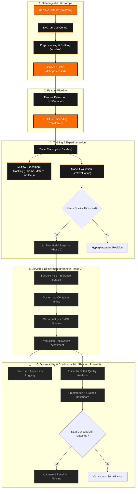

# System Architecture & Technical Design

> **Project:** AI-Based Interview Preparation Assistant  
> **Course:** AI252TA – Machine Learning Operations | Semester V  
> **Status:** Phase 0 Blueprint  

---

## 1. Architectural Scope

This directory contains technical design specifications, architecture diagrams, dataflow schemas, and component interaction models for the **AI-Based Interview Preparation Assistant**.

The system is engineered as an end-to-end production MLOps pipeline designed to ingest candidate interview responses, evaluate semantic correctness and depth, classify quality into 4 standardized tiers, and deliver low-latency feedback.

---

## 2. End-to-End Architectural Blueprint

---

## 3. Component Details & Phased Roadmap

1. **Data & Storage Pipeline (Phase 1):**
   - Versioned storage with DVC.
   - Text normalization, deduplication, and stratified train/val/test splits.
2. **Feature Pipeline (Phase 1):**
   - Text vectorization (TF-IDF, n-grams, answer length ratios).
   - Serializable scikit-learn transformers.
3. **Training & Tracking (Phase 1):**
   - Baseline models: Logistic Regression, Random Forest.
   - Experiment tracking with MLflow (parameters, F1-scores, loss curves).
4. **Production Inference Service (Phase 2):**
   - High-throughput FastAPI REST API with input validation (`pydantic`).
   - Containerization via Docker multi-stage builds.
5. **Observability & Feedback Loop (Phase 3):**
   - Real-time logging of predictions.
   - Evidently test suites to detect vocabulary drift and concept shift.

---

## 4. Planned Documents in this Directory

- `data_flow.md` — Detailed sequence diagram of training and inference flows.
- `api_spec.md` — OpenAPI/Swagger schemas for the inference service.
- `deployment_topology.md` — Container orchestration and infrastructure definitions.
