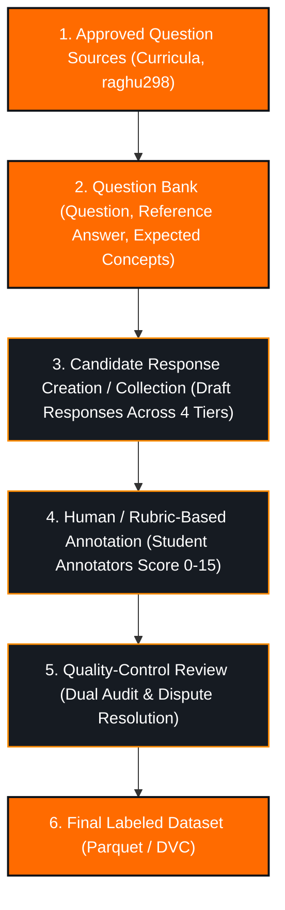

# Dataset Specification: AI-Based Interview Preparation Assistant

> **Document Type:** Academic Dataset Specification & ML Formulation  
> **Course:** AI252TA – Machine Learning Operations | Semester V  
> **Repository:** [https://github.com/Tejzraj/MLOps.git](https://github.com/Tejzraj/MLOps.git)  
> **Status:** PROPOSED METHODOLOGY (Pending Faculty Review & Validation)  
> **Current Version:** `v0.1.2-draft`  

---

## 1. Project Context

The **AI-Based Interview Preparation Assistant** is an end-to-end Machine Learning Operations system designed to facilitate structured mock interview simulations for students and job seekers. The complete product will conduct an interactive interview session across diverse engineering domains and difficulty levels, record candidate responses, evaluate answer quality across multiple pedagogical dimensions, and generate a comprehensive feedback report.

Within the overall system architecture, an explicit separation of concerns is maintained:
- **Application Layer:** Manages session state, interview flow, question selection, follow-up generation, and final report compilation.
- **ML / MLOps Layer:** Strictly focused on a tractable, defensible ML task: **evaluating the quality of a candidate's textual response to an interview question against domain expectations.**

---

## 2. Problem Definition

In traditional interview preparation, candidates receive subjective or infrequent feedback due to the scarcity of experienced human evaluators. Automated assessment requires an ML model capable of distinguishing between superficial, partially accurate, and conceptually thorough technical responses.

The challenge is formulated as:
$$\text{Quality} = f(\text{Question}, \text{Candidate Answer}, \text{Reference Answer}, \text{Expected Concepts}, \text{Domain}, \text{Difficulty})$$

The ML model must compute semantic relevance, conceptual completeness, and factual correctness to categorize the answer into a standardized quality tier.

---

## 3. ML Objective

The primary Phase-1 machine learning objective is **Supervised Multi-Class Classification**.

- **Target Task:** Classify a candidate's answer into one of four ordinal quality tiers:
  - `0`: Poor
  - `1`: Needs Improvement
  - `2`: Good
  - `3`: Excellent
- **Secondary Multi-Dimensional Targets (Human-Annotated Labels):**
  - Correctness score ($0 - 5$)
  - Completeness score ($0 - 5$)
  - Communication clarity score ($0 - 5$)
  - Aggregate composite score ($0 - 15$)

---

## 4. Input Definition & Artifact Roles

The Phase-1 model accepts structured textual inputs:

| Input Component | Type | Functional Role in Pipeline | Example |
| :--- | :--- | :--- | :--- |
| `interview_question` | `string` | The technical prompt presented to the candidate. | `"Explain the difference between a process and a thread."` |
| `candidate_answer` | `string` | The verbatim textual answer submitted by the candidate for evaluation. | `"A process has its own memory space, whereas threads share the memory of their parent process."` |
| `reference_answer` | `string` | **Expert-reviewed reference answer** (reviewed against approved source material) used to anchor the evaluation by detailing expected depth. | `"A process is an independent execution unit with its own virtual address space... Threads are subunits within a process..."` |
| `expected_concepts` | `string` | Semicolon-delimited list of essential keywords, concepts, or trade-offs. | `"memory space; context switching; isolation; concurrency"` |
| `domain` | `string` | One of the 10 approved technical domains. | `"Operating Systems"` |
| `difficulty` | `string` | Difficulty tier of the question (`Easy`, `Medium`, `Hard`). | `"Medium"` |

### Critical Conceptual Distinctions
To preserve scientific rigor, the pipeline strictly distinguishes three separate entities:
1. **Candidate Answer (`candidate_answer`):** The unverified text response submitted for assessment.
2. **Reference Answer (`reference_answer`):** An expert-reviewed exemplar answer reviewed against approved curriculum materials to assist human annotators and evaluation models. **The reference answer is an evaluation support tool; it is NOT automatically ground truth for candidate quality.**
3. **Annotated Quality Label (`quality_label`):** The ground-truth rating produced exclusively by human annotators applying the standardized multi-dimensional rubric.

### Data Modality Justification (Text-First Architecture)
* **Phase 1 Modality:** **Text-Only**.
* **Rationale:** Interview speech processing introduces acoustic noise, non-verbal disfluency models, accent biases, and automatic speech recognition (ASR) errors. By focusing strictly on text evaluation in Phase 1, the core MLOps lifecycle (reproducible feature engineering, model registry, drift detection, and evaluation metrics) is thoroughly established without confounding errors from secondary speech-to-text models.
* **Future Extension Roadmap:** In Phase 2+, Audio will be ingested via a decoupled ASR module ($\text{Audio} \rightarrow \text{Whisper ASR} \rightarrow \text{Transcript Text}$) feeding directly into this exact evaluation pipeline.

---

## 5. Output Definition

The primary output is an ordinal classification label:

$$\hat{y} \in \{0, 1, 2, 3\}$$

Along with class prediction probabilities:
$$P(Y = c \mid X), \quad c \in \{0, 1, 2, 3\}$$

---

## 6. Dataset Scope

The target dataset will initially contain curated question-answer pairs balanced across:
1. Three difficulty tiers: Easy, Medium, Hard.
2. Four quality tiers: Equal distribution across Poor, Needs Improvement, Good, and Excellent.
3. Ten core technical computer science and AI domains.

---

## 7. Supported Domains (10 Technical Domains)

The dataset taxonomy covers exactly ten technical engineering domains:

1. **Data Structures & Algorithms (DSA)**
2. **Object-Oriented Programming (OOP)**
3. **Database Management Systems (DBMS)**
4. **Computer Networks (CN)**
5. **Operating Systems (OS)**
6. **Python**
7. **C/C++**
8. **Java**
9. **Machine Learning (ML)**
10. **Artificial Intelligence (AI)**

*Note: Behavioral and HR assessments are classified strictly as a **Question Type**, not a technical domain.*

---

## 8. Difficulty Levels

* **Easy:** Fundamental definitions, core syntax, time complexities of elementary operations, standard terminology (e.g., *"What is method overloading?"*).
* **Medium:** Comparative analysis, system mechanics, practical implementations, trade-off evaluations (e.g., *"Compare TCP and UDP in terms of reliability and overhead"*).
* **Hard:** Low-level architectural edge cases, concurrency hazards, distributed design considerations, optimization nuances (e.g., *"How does the OS handle thrashing and how does working set theory mitigate it?"*).

---

## 9. Question Types

* **Conceptual:** Assessing foundational theoretical clarity, definitions, and principles.
* **Comparative:** Evaluating the ability to analyze trade-offs between competing architectures, data structures, or algorithms.
* **Diagnostic:** Assessing debugging skills and failure analysis given a concrete bug or system bottleneck.
* **Behavioral / HR:** Evaluating structured communication (e.g., STAR framework), ownership, and professional teamwork.

---

## 10. Dataset Schema

The dataset will be maintained in Apache Parquet format (with CSV export capability).

| Field Name | Data Type | Nullable | Description |
| :--- | :--- | :---: | :--- |
| `question_id` | `string` | No | Unique immutable identifier for the prompt (e.g., `Q_OS_042`). |
| `domain` | `string` | No | One of the 10 approved technical domains. |
| `difficulty` | `string` | No | `Easy`, `Medium`, or `Hard`. |
| `question_type` | `string` | No | `Conceptual`, `Comparative`, `Diagnostic`, or `Behavioral / HR`. |
| `question` | `string` | No | Full question text prompt. |
| `reference_answer` | `string` | No | **Expert-reviewed reference answer** (reviewed against approved source material). |
| `expected_concepts` | `string` | No | Semicolon-separated key technical terms. |
| `candidate_answer` | `string` | No | Response submitted for evaluation. |
| `correctness_score` | `int64` | No | Human rubric rating from 0 to 5. |
| `completeness_score`| `int64` | No | Human rubric rating from 0 to 5. |
| `communication_score`| `int64`| No | Human rubric rating from 0 to 5. |
| `total_score` | `int64` | No | Sum of dimensional scores ($0 - 15$). |
| `quality_label` | `int64` | No | Target class label: `0`, `1`, `2`, or `3`. |
| `source` | `string` | No | Provenance tag (e.g., `raghu298_hf`, `rvce_syllabus`). |
| `source_license` | `string` | No | License governing source question (e.g., `Apache-2.0`, `MIT`, `CC-BY-4.0`). |
| `annotator_id` | `string` | No | **Anonymous identifier** of the student annotator (e.g., `ANN_01`, `ANN_02`). Strictly zero student names, USNs, emails, or PII. |
| `annotation_method` | `string` | No | Protocol used (e.g., `human_rubric_adjudicated`, `team_consensus`). |
| `version` | `string` | No | Dataset semantic version (e.g., `v1.0.0`). |
| `split_group` | `string` | No | Grouping key (`question_id`) used to prevent question leakage across splits. |

---

## 11. Label Definitions

```
                     ┌───────────────────────────────────────────────┐
                     │           Quality Classification              │
                     └───────────────────────┬───────────────────────┘
                                             │
         ┌───────────────────┬───────────────┴───────────────┬───────────────────┐
         ▼                   ▼                               ▼                   ▼
      Class 0             Class 1                         Class 2             Class 3
     [ Poor ]      [ Needs Improvement ]                  [ Good ]         [ Excellent ]
  Score: 0 – 3          Score: 4 – 7                    Score: 8 – 11      Score: 12 – 15
```

- **0 — Poor:** The response is fundamentally inaccurate, incoherent, completely off-topic, or contains fewer than 5 tokens without answering the question.
- **1 — Needs Improvement:** The response touches upon the topic but misses major core concepts, exhibits critical misconceptions, or lacks technical substance.
- **2 — Good:** The response is factually accurate and addresses the core prompt correctly with reasonable clarity, though it may lack minor nuances, concrete examples, or edge-case discussions.
- **3 — Excellent:** The response is comprehensive, highly articulate, technically precise, mentions practical trade-offs or edge cases, and directly addresses all expected concepts.

---

## 12. Evaluation Rubric

Each candidate answer is graded across three orthogonal 5-point dimensions:

$$\text{Total Score} = S_{\text{correctness}} + S_{\text{completeness}} + S_{\text{communication}}$$

### A. Correctness ($0 - 5$)
- `0`: Completely wrong, irrelevant, or factually misleading.
- `1`: Minimal accurate information; dominated by errors.
- `2`: Partially correct, but contains notable misconceptions.
- `3`: Mostly correct; core facts are sound, minor errors present.
- `4`: Highly accurate with negligible ambiguities.
- `5`: Fully accurate with no identified substantive factual errors, rigorous, and technically sound.

### B. Completeness ($0 - 5$)
- `0`: No meaningful answer provided.
- `1`: Extremely incomplete; touches only a single superficial point.
- `2`: Covers limited concepts; omits major structural elements.
- `3`: Covers major concepts; misses secondary considerations or examples.
- `4`: Nearly complete; covers almost all expected concepts.
- `5`: Comprehensive; covers all primary, secondary, and trade-off concepts.

### C. Communication ($0 - 5$)
- `0`: Unintelligible or disorganized gibberish.
- `1`: Very unclear; chaotic train of thought; confusing jargon misuse.
- `2`: Understandable but disorganized; rambling or unstructured.
- `3`: Reasonably clear; readable structure; standard technical phrasing.
- `4`: Clear, well-structured, logical progression of thoughts.
- `5`: Concise, precise, highly professional, exemplary interview delivery.

---

## 13. Proposed Quality Label Thresholds

> [!WARNING]
> **Status of Score Thresholds:** The proposed score intervals below are **PROPOSED**, **SUBJECT TO FACULTY VALIDATION**, and **SUBJECT TO ANNOTATION CALIBRATION**.
>
> They are **not** scientifically validated constants or established ground truth. They serve as an initial rubric-based working hypothesis and will be calibrated and finalized based on empirical pilot annotations and formal course faculty sign-off.

$$\text{Proposed Quality Mapping} = \begin{cases} 
0 \text{ (Poor)} & 0 \le \text{Total} \le 3 \\ 
1 \text{ (Needs Improvement)} & 4 \le \text{Total} \le 7 \\ 
2 \text{ (Good)} & 8 \le \text{Total} \le 11 \\ 
3 \text{ (Excellent)} & 12 \le \text{Total} \le 15 
\end{cases}$$

---

## 14. Data Sources & Candidate Benchmark Investigation

To ground this specification in external evidence, candidate publicly referenced sources were investigated:

| Source Identifier | Host / URL | License Status | Purpose | Quality Labels Present? | Usability for Project |
| :--- | :--- | :---: | :--- | :---: | :--- |
| **`raghu298/ml-interview-sft-dataset`** | [HuggingFace](https://huggingface.co/datasets/raghu298/ml-interview-sft-dataset) | **Apache-2.0** *(Candidate license identified via repository metadata; pending formal verification of project subset)* | SFT dataset for training conversational ML interview agents. Contains `question`, `answer`, `messages`. | **NO** (Only reference answers) | Suitable as a candidate source for **interview questions and reference material** in the ML domain. Cannot serve as an evaluation training set without collecting/creating candidate answers and performing human labeling. |
| **`Max00035/ml-systems-interview-bench`** | HuggingFace / GitHub | *LICENSE VERIFICATION REQUIRED* | ML Systems interview questions and benchmarks. | **NO** (Unverified) | Pending formal license verification and schema inspection. Cannot be ingested until licensed. |
| **`Ankshi/hr-interview-dataset`** | HuggingFace / GitHub | *LICENSE VERIFICATION REQUIRED* | HR and behavioral interview question collection. | **NO** (Unverified) | Unverified public repository. Requires faculty approval and verification before use. |

---

## 15. Defensible Data Generation & Annotation Methodology

In an academic and production ML engineering project, **AI-generated answers or automated LLM ratings must NEVER be blindly treated as ground-truth labels.**

The dataset pipeline enforces the following strict academic lifecycle:

```
Dataset specification
        ↓
Faculty review/approval
        ↓
Source/license verification
        ↓
Question normalization
        ↓
Domain/difficulty categorization
        ↓
Reference-answer preparation
        ↓
Candidate response collection/creation
        ↓
Human/rubric-based annotation
        ↓
QC/validation
        ↓
Final dataset
        ↓
DVC versioning
        ↓
EDA
        ↓
Feature engineering
        ↓
Baseline models
        ↓
MLflow experimentation
```



### Explicit Functional Distinctions:
1. **Response Generation / Collection:** Producing candidate textual answers representing different levels of understanding. This creates raw candidate text, **not** labels.
2. **Annotation:** Human reviewers independently applying the documented 15-point rubric to evaluate Correctness, Completeness, and Communication.
3. **Validation:** Secondary review on a sample of rows by a second team member to identify ambiguous interpretations.
4. **Quality Control:** Resolving score discrepancies through consensus and auditing class balance prior to DVC commitment.

---

## 16. Use of AI-Assisted Synthetic Responses

> [!CAUTION]
> **Strict Academic Boundaries on Synthetic Text:**
> - If AI tools (e.g., LLM prompting) are utilized to assist in drafting candidate response text across different proficiency tiers, they serve **solely as a controlled data-generation aid**, subject to explicit faculty approval.
> - **Synthetic candidate answers are NOT real student responses.** They must never be represented as empirical human interview behavior.
> - **AI-generated outputs are NEVER treated as ground truth.** Every synthetic draft response must be inspected, evaluated, and scored by human annotators adhering strictly to [`LABELING_GUIDELINES.md`](LABELING_GUIDELINES.md).
> - LLM self-evaluation (asking an LLM to grade its own or other answers without human verification) is **strictly disallowed** for ground truth creation.

---

## 17. Human Validation Strategy (Semester V Academic Protocol)

To ensure academic defensibility without making unrealistic claims:
1. **Student Team Annotation:** Rubric annotation is performed by project team members following the standardized scoring guide.
2. **Independent Dual-Audit Subset:** A dedicated subset of responses ($15\% - 20\%$) will be independently annotated by two different team members without seeing each other's scores.
3. **Dispute Resolution:** Scoring discrepancies exceeding 2 points on any dimension or differing in the resulting quality class will be discussed and adjudicated using the rubric.
4. **Consistency Reporting:** Inter-annotator agreement metrics (such as Cohen's Kappa or percentage agreement) will be computed and documented **only after actual annotation is performed**. No fabricated consistency numbers are claimed in advance.
5. **No False Claims:** Faculty members are recognized as evaluators and reviewers; they will not be claimed as annotators unless they actively participate in labeling.

---

## 18. Data Quality Requirements

1. **Zero Null Policy:** No missing values permitted in `interview_question`, `candidate_answer`, `reference_answer`, or `quality_label`.
2. **Length Guardrails:** Candidate answers must have a minimum token length of $\ge 5$ tokens (unless classified as Poor with $0$ score).
3. **Class Parity:** Phase-1 training dataset must maintain roughly equal representation ($25\% \pm 3\%$) across all four quality classes.
4. **Lexical Deduplication:** Exact string duplicates in candidate answers across different question IDs are prohibited.

---

## 19. Proposed Train / Validation / Test Strategy

> [!NOTE]
> The partitioning ratios and random seed below represent **PROPOSED METHODOLOGY** pending faculty review and validation during Phase-1 dataset construction.

* **Proposed Splits:**
  - **Train:** $70\%$
  - **Validation:** $10\%$
  - **Test:** $20\%$
* **Random State:** Pinned to `42` (`params.yaml`).
* **Stratification:** Stratified by `quality_label` to preserve target distributions across splits.

---

## 20. Data Leakage Prevention (Group-Based Splitting)

> [!IMPORTANT]
> **Strict Leakage Guard:** A standard random split across individual rows causes **Data Leakage**. If candidate answers to question $Q_k$ appear in both the training set and the test set, the model might simply memorize question-specific vocabulary rather than learning true answer quality evaluation.

To prevent this:
1. **Grouped Splitting by Question ID:** Splitting will be performed at the **`question_id`** or **`split_group`** level using `GroupKFold` or `GroupShuffleSplit`.
2. All candidate answers corresponding to a specific question will reside **exclusively in either train, validation, or test**.
3. This ensures the model is evaluated on **unseen questions**, strictly testing generalized evaluation capability.

---

## 21. Privacy Considerations & Zero-PII Policy

- **Zero Personally Identifiable Information (PII):** No student names, candidate identifiers, USNs, email addresses, phone numbers, or organizational references will be collected or stored.
- **Anonymous Annotator Tokens:** Annotators are referenced solely via anonymous keys (`ANN_01`, `ANN_02`).
- **Anonymization Verification:** All synthesized or collected answers are passed through regular-expression filters and PII scrubbers prior to ingestion.

---

## 22. Bias & Limitations

1. **Synthetic-Data Bias:** If AI assistance is used to draft candidate answers, models may inadvertently pick up stylistic tropes, repetitive syntax, or artificial sentence structures characteristic of generative LLMs.
2. **Limited Annotator Diversity:** Annotation performed by student team members reflects academic peer evaluations and may not perfectly capture senior industry interviewer expectations.
3. **Domain Coverage Limitations:** Phase 1 covers 10 core computer science and AI domains. Specialized or interdisciplinary subjects are not covered.
4. **Subjectivity in Communication Scoring:** While the 5-point rubric bounds evaluation, communication scoring contains inherent human subjectivity regarding conciseness versus descriptive depth.
5. **Mismatch Between Synthetic and Real Interview Responses:** Synthetic responses may lack real-world candidate phenomena such as spontaneous verbal re-phrasing, colloquial pauses, and authentic exam stress patterns.
6. **Textual Modality Scope:** Does not capture vocal tone, pacing, hesitation, or non-verbal cues (deferred to future phases).

---

## 23. Versioning Strategy

- **Semantic Data Versioning:** Datasets adhere to `vMAJOR.MINOR.PATCH`:
  - `v0.1.0`: Initial schema and pilot sample.
  - `v1.0.0`: First approved Phase-1 training corpus.
- **Change Log:** Every modification to schema, rubric, or sample rows triggers a version bump and DVC commit.

---

## 24. DVC Integration

- Raw datasets are stored in `data/raw/interview_data.csv` / `data/raw/interview_data.parquet`.
- Tracked via `.dvc` pointer files committed to Git:
  ```bash
  dvc add data/raw/interview_data.parquet
  git add data/raw/interview_data.parquet.dvc .gitignore
  ```
- Git stores zero MB of raw data; DVC handles cryptographic hash tracking.
- *Notice: DVC dataset tracking will occur only after the approved dataset is assembled.*

---

## 25. Faculty Review & Acceptance Criteria

The Phase-1 dataset will be accepted into the training pipeline if and only if:
- [ ] Faculty evaluation committee reviews and signs off on [`docs/dataset/DATASET_APPROVAL.md`](DATASET_APPROVAL.md).
- [ ] Schema strictly adheres to the 19 specified fields (including anonymous `annotator_id`).
- [ ] All 10 technical domains have representative coverage.
- [ ] Grouped splitting is verified with zero overlapping `question_id` instances between train and test.
- [ ] Team dual-audit subset is annotated and consistency is documented without fabrication.
- [ ] DVC tracking is verified with valid Git pointer metadata.
