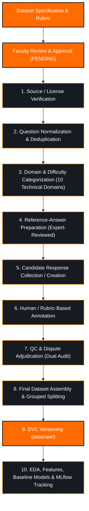

# Data Collection & Annotation Protocol

> **Project:** AI-Based Interview Preparation Assistant  
> **Course:** AI252TA – Machine Learning Operations | Semester V  
> **Document Status:** PLANNED METHODOLOGY (Collection & Annotation Not Yet Started)  
> **Last Updated:** 2026-09-27  

---

## 1. Overview & Core Methodological Principle

This document outlines the end-to-end data acquisition, response creation, annotation, quality control, and versioning protocol for the **AI-Based Interview Preparation Assistant**.

> [!IMPORTANT]
> **Defensibility & Scientific Integrity Rules:**
> 1. **No Automated Ground Truth:** AI-generated outputs or automated LLM ratings must **never** be blindly treated as ground truth. All ground-truth quality scores must originate from human rubric-based evaluation.
> 2. **Reference Answer Role:** The reference answer is an **expert-reviewed reference answer** (reviewed against approved curriculum material) designed to assist annotators and evaluation models by illustrating required depth. It is an evaluation support tool, **not** automatically ground truth for candidate answer quality.
> 3. **Explicit Functional Separation:** We strictly separate *Response Generation* (gathering text) from *Annotation* (evaluating quality), *Validation* (independent auditing), and *Quality Control* (statistical verification).
> 4. **Honest Project Status:** All collection, annotation, and verification activities are currently **PLANNED / PENDING VERIFICATION**. No production dataset has been collected, labeled, or committed.

---

## 2. End-to-End MLOps Academic Data Sequence

The project adheres to a strict, sequential academic pipeline where downstream steps are blocked until preceding milestones receive approval:

```
Dataset specification
        ↓
Faculty review/approval
        ↓
Source/license verification
        ↓
Question normalization
        ↓
Domain/difficulty categorization
        ↓
Reference-answer preparation
        ↓
Candidate response collection/creation
        ↓
Human/rubric-based annotation
        ↓
QC/validation
        ↓
Final dataset
        ↓
DVC versioning
        ↓
EDA
        ↓
Feature engineering
        ↓
Baseline models
        ↓
MLflow experimentation
```



---

## 3. Detailed Stage Specifications

### Stage 1: Question Source Ingestion
- **Objective:** Curate candidate technical interview questions and reference materials from publicly permissible sources.
- **Candidate Sources Identified (Pending Formal Verification):**
  - `raghu298/ml-interview-sft-dataset` (Apache-2.0 candidate, Machine Learning domain).
  - Standard academic computer science curricula (Operating Systems, DBMS, Computer Networks, OOP, Data Structures).
- **Status:** `[ ] PENDING VERIFICATION` (Sources identified; formal verification pending faculty approval)

### Stage 2: Source & License Verification
- **Objective:** Verify intellectual property rights and permitted educational/open-source usage with repository-level documentation.
- **Protocol:**
  - Record verified source URL, commit/release tag, author, and official license file.
  - If a license is absent, ambiguous, or unverifiable, mark as `LICENSE VERIFICATION REQUIRED` and exclude from the ingestion pipeline.
- **Status:** `[ ] PENDING VERIFICATION`

### Stage 3: Question Normalization & Deduplication
- **Objective:** Standardize phrasing, eliminate duplicate questions, and ensure clear pedagogical intent.
- **Protocol:**
  - Normalize whitespace, Unicode characters, and formatting.
  - Compute lexical similarity to identify overlapping questions ($> 85\%$ overlap).
  - Select the cleanest, most unambiguous prompt.
- **Status:** `[ ] PLANNED`

### Stage 4: Domain & Difficulty Categorization
- **Objective:** Classify each verified question into one of the **10 approved technical domains** and assign a difficulty tier (`Easy`, `Medium`, `Hard`).
- **Approved Domains:**
  1. Data Structures & Algorithms (DSA)
  2. Object-Oriented Programming (OOP)
  3. Database Management Systems (DBMS)
  4. Computer Networks (CN)
  5. Operating Systems (OS)
  6. Python
  7. C/C++
  8. Java
  9. Machine Learning (ML)
  10. Artificial Intelligence (AI)
  *(Behavioral and HR questions are classified under `question_type`, not as a technical domain.)*
- **Status:** `[ ] PLANNED`

### Stage 5: Reference-Answer & Concept Extraction
- **Objective:** Establish an **expert-reviewed reference answer** (reviewed against approved source material) and a list of `expected_concepts` for every question in the question bank.
- **Protocol:**
  - Formulate a reference answer covering expected technical depth.
  - List 3 to 6 essential technical terms/concepts (e.g., for process vs. thread: `virtual memory`, `context switch overhead`, `thread isolation`, `shared address space`).
  - *Note: Reference answers support human annotation and model evaluation; they do not dictate candidate ground truth.*
- **Status:** `[ ] PLANNED`

### Stage 6: Candidate Response Creation / Collection
- **Objective:** Assemble a pool of unannotated candidate textual answers exhibiting diverse quality levels.
- **Protocol:**
  - Responses may be collected from volunteer student mock interviews or drafted as controlled response variants representing varying degrees of conceptual clarity.
  - **Important:** At this stage, responses are strictly **unlabeled candidate text**. No ground truth is assigned yet.
- **Status:** `[ ] PLANNED`

### Stage 7: Human / Rubric-Based Annotation
- **Objective:** Assign rigorous quality scores to each candidate response using [`LABELING_GUIDELINES.md`](LABELING_GUIDELINES.md).
- **Protocol:**
  - Student annotators grade each answer across three independent dimensions ($0 - 5$ each):
    - Correctness ($0 - 5$)
    - Completeness ($0 - 5$)
    - Communication ($0 - 5$)
  - Total score ($0 - 15$) maps to the **PROPOSED** quality tier (strictly **SUBJECT TO FACULTY VALIDATION AND ANNOTATION CALIBRATION**):
    - $0 - 3 \rightarrow$ `0: Poor`
    - $4 - 7 \rightarrow$ `1: Needs Improvement`
    - $8 - 11 \rightarrow$ `2: Good`
    - $12 - 15 \rightarrow$ `3: Excellent`
  - Record anonymous `annotator_id` (e.g., `ANN_01`, `ANN_02`) and timestamp. Zero student names, USNs, or emails stored.
- **Status:** `[ ] NOT STARTED`

### Stage 8: Independent Validation & Disagreement Resolution
- **Objective:** Audit annotation consistency and resolve edge-case scoring disputes.
- **Protocol (Semester V Team Strategy):**
  - A dual-audit subset ($15\% - 20\%$ of samples) is independently evaluated by a second student team member without viewing the initial scores.
  - Disagreements exceeding 2 points on any dimension or differing in assigned class are flagged for discussion.
  - Discrepancies are adjudicated by re-evaluating the candidate text against the rubric criteria.
  - Inter-annotator agreement metrics will be calculated and documented **after** annotation is completed. No speculative metrics are claimed in advance.
- **Status:** `[ ] NOT STARTED`

### Stage 9: Quality Control & Grouped Splitting
- **Objective:** Enforce data integrity standards and prevent data leakage across dataset partitions.
- **Protocol:**
  - Programmatically verify zero null fields and validate length constraints.
  - Enforce **Grouped Splitting by `question_id`**: All responses belonging to a single question are partitioned into either Train ($70\%$), Validation ($10\%$), or Test ($20\%$).
- **Status:** `[ ] NOT STARTED`

### Stage 10: Final Dataset Assembly & DVC Versioning
- **Objective:** Package the validated dataset into Apache Parquet format and register it under Data Version Control (DVC).
- **Protocol:**
  - Export to `data/raw/interview_data.parquet`.
  - Execute `dvc add data/raw/interview_data.parquet`.
  - Commit pointer file `data/raw/interview_data.parquet.dvc` into Git.
- **Status:** `[ ] NOT STARTED`

---

## 4. Use of AI-Assisted Synthetic Responses

> [!CAUTION]
> **Academic Boundaries on Synthetic Text:**
> - If LLM prompting or generative tools are utilized during Stage 6 to help draft candidate responses across different proficiency tiers, they serve **solely as a controlled data-generation aid**, subject to explicit faculty approval.
> - **Synthetic candidate responses are NOT real student responses.** They must never be described as empirical student interview performance.
> - **Synthetic responses must NOT be treated as ground truth.** The fact that an LLM was prompted to create a "Poor" or "Good" response does not make it ground truth. It must undergo the identical rubric evaluation and human validation process as any other response.
> - LLM-generated self-ratings are **strictly forbidden** as dataset labels.

---

## 5. Pipeline Summary & Status Matrix

| Pipeline Stage | Functional Role | Responsible Mechanism | Current Status |
| :--- | :--- | :--- | :---: |
| 1. Source Ingestion | Question Harvester | External Repos & Curricula | `[ ] PENDING VERIFICATION` |
| 2. License Audit | Provenance Verification | License Review Checklist | `[ ] PENDING VERIFICATION` |
| 3. Normalization | Data Cleansing | Python Text Preprocessor | `[ ] PLANNED` |
| 4. Categorization | Taxonomy Mapping | 10 Technical Domains Guide | `[ ] PLANNED` |
| 5. Reference Answers | Reference Alignment | Expert-Reviewed Material | `[ ] PLANNED` |
| 6. Response Creation | Raw Text Generation | Controlled Response Pool | `[ ] PLANNED` |
| 7. Rubric Annotation | Ground-Truth Labeling | Human Student Annotators | `[ ] NOT STARTED` |
| 8. Validation Audit | Agreement & Resolution | Team Dual Review Protocol | `[ ] NOT STARTED` |
| 9. Grouped Splitting | Anti-Leakage Partition | GroupShuffleSplit (`params.yaml`) | `[ ] NOT STARTED` |
| 10. DVC Versioning | Artifact Tracking | DVC CLI & Git Metadata | `[ ] NOT STARTED` |

---

## 6. Next Immediate Action

Awaiting formal course faculty review and sign-off on [`DATASET_APPROVAL.md`](DATASET_APPROVAL.md) before executing source/license verification and question normalization.
